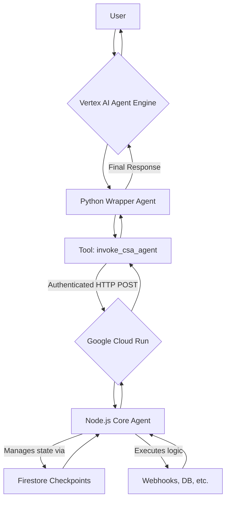

# Vision 101: Hybrid Deployment Plan

This document outlines the architecture and deployment steps for our production-grade agent using a hybrid model that combines the strengths of **Google Cloud Run** and the **Vertex AI Agent Engine**.

## 🚀 Architecture Overview

Our system consists of two main components:

1.  **Core Agent (Node.js on Cloud Run)**: The complex, stateful agent you have already built. It contains all the core business logic, `LangGraph` state machine, tool integrations (webhooks), and knowledge base connections.
    *   **Responsibility**: All heavy lifting and conversational logic.
    *   **Deployment**: Deployed as a secure, private service on Cloud Run.

2.  **Wrapper Agent (Python on Agent Engine)**: A lightweight, stateless agent whose only job is to act as a secure gateway to the Core Agent.
    *   **Responsibility**: Provides a public endpoint, handles session management via Agent Engine, and calls the Core Agent.
    *   **Deployment**: Deployed on Vertex AI Agent Engine.

### Data Flow



---

## 🔧 Deployment Steps

### Part 1: Deploy the Node.js Core Agent to Cloud Run

1.  **Build the Docker Image**: Use the existing `Dockerfile` to containerize the Node.js application.
    ```bash
    gcloud builds submit --tag gcr.io/$(gcloud config get-value project)/csa-agent-backend:latest .
    ```

2.  **Deploy to Cloud Run**: Deploy the container as a private service.
    *   `--no-allow-unauthenticated`: This is critical. The service should only be callable by other authenticated GCP services, like our Agent Engine wrapper.
    *   Set necessary environment variables (database credentials, webhook secrets, etc.).

    ```bash
    gcloud run deploy csa-agent-backend-service \
      --image gcr.io/$(gcloud config get-value project)/csa-agent-backend:latest \
      --platform managed \
      --region us-central1 \
      --no-allow-unauthenticated \
      --set-env-vars="DB_USER=your_user,DB_PASSWORD=your_pass,..." # Add all required env vars
    ```

3.  **Retrieve the Service URL**: Once deployed, copy the Cloud Run service URL. You will need this for the next part. It will look like `https://csa-agent-backend-service-xxxxxxxx-uc.a.run.app`.

### Part 2: Deploy the Python Wrapper to Agent Engine

1.  **Set Environment Variable**: The Python wrapper needs to know where to send requests. Set the `CSA_AGENT_URL` environment variable to the URL you copied in the previous step.

    ```bash
    export CSA_AGENT_URL="https://csa-agent-backend-service-xxxxxxxx-uc.a.run.app"
    ```

2.  **Grant Permissions**: The Agent Engine service needs permission to invoke the Cloud Run service.
    *   Find the service account used by Agent Engine (this is typically the default Compute Engine service account or a custom one you specify).
    *   Grant this service account the **Cloud Run Invoker** (`roles/run.invoker`) role on your deployed `csa-agent-backend-service`.

    ```bash
    # Example: Granting invoke permissions to the default compute service account
    gcloud run services add-iam-policy-binding csa-agent-backend-service \
      --member="serviceAccount:$(gcloud projects describe $(gcloud config get-value project) --format='value(projectNumber)')-compute@developer.gserviceaccount.com" \
      --role="roles/run.invoker" \
      --region=us-central1
    ```

3.  **Deploy the Agent**: Navigate to the `agent_engine_wrapper` directory and run the deployment script.

    ```bash
    cd agent_engine_wrapper
    
    # Ensure you are authenticated
    gcloud auth application-default login

    # Install dependencies
    pip install -r requirements.txt

    # Run the deployment from main.py
    # This command uses the environment variables you set earlier
    python main.py
    ```
    *Note: For the deployment script in `main.py` to run, you must first set `export DEPLOY_AGENT=true`.*

---

## ✅ Production Ready

Once both services are deployed:

-   Your public-facing agent is the one running on **Agent Engine**.
-   Agent Engine provides the session management, observability, and scalability for the entry point.
-   The core logic remains securely encapsulated within your private **Cloud Run** service.
-   This architecture allows you to add new, simple tools directly in the Python wrapper while keeping the complex core logic stable, achieving a maintainable and production-grade system. 